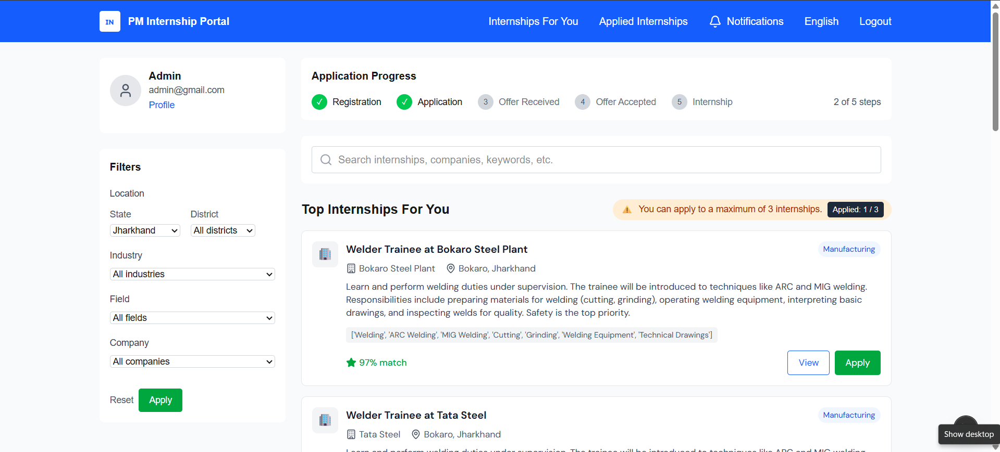
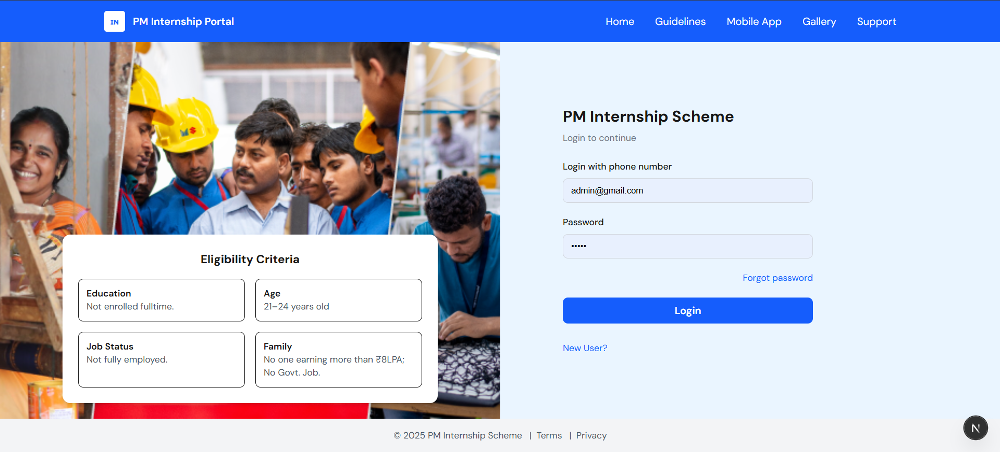

# Ship of Theseus — AI-Powered Internship Recommendation Portal

An intelligent web platform developed for the **PM Internship Scheme**, built to personalize internship recommendations using **AI-driven job-to-skill matching**.  
The portal was developed under the **Smart India Hackathon 2025** (Problem Statement ID: 25034) and aims to bridge the urban–tech divide by helping students find the most relevant internships, even in low-connectivity environments.

---

## Overview

**Ship of Theseus** is an **AI-based Internship Recommendation Platform** that leverages **machine learning**, **NLP**, and **multilingual AI assistants** to streamline the internship process for students and administrators.

The system automatically recommends the **top 5 best-fit internships** for every student profile, provides **skill-bridging resources**, and enables **dynamic CV generation** aligned with recruiter expectations.

Built with **Next.js**, **Node.js**, and **Python (Flask)**, the portal integrates a **DL-powered recommendation engine**, **OCR verification**, **auto-sync capabilities**, and **multilingual support** for all 22 Indian languages.

---

### Home Page


## Demo Video

Experience the complete walkthrough of the **Ship of Theseus – AI-Powered Internship Portal** in action!  
The demo showcases key functionalities including student onboarding, AI-based internship recommendations and CV generation.

[](https://youtu.be/nzo6fj3wUtQ)


## Features

1. **Personalized Internship Recommendations**
   - AI model recommends top 5 internships based on profile, education, and skills.
2. **Skill Gap Identification**
   - Suggests relevant **NPTEL courses, YouTube tutorials, and blogs** to bridge missing skills.
3. **Dynamic CV Generation**
   - Automatically generates tailored CVs matching each job’s requirements.
4. **AI-Powered Assistant**
   - Chatbot guides users through form-filling, navigation, and resolving application-related queries.
5. **Offline Auto-Sync**
   - Allows users to fill forms offline and sync data automatically when connectivity is restored.
6. **Multilingual Interface**
   - Supports all **22 Indian languages**, ensuring inclusivity and accessibility.

---

## Technical Architecture

**Recommendation Engine Flow:**
1. Extract embeddings for job descriptions (J1…JM) and resumes (R1…RN)
2. Compute **pairwise similarity matrix**
3. Calculate **Candidate Coverage Score (geometric mean of column matches)**
4. Compute **Job Relevance Score (arithmetic mean of row matches)**
5. Apply **weighted average + nonlinear transform**
6. Output → **Final A-Score** (Internship relevance ranking)

---

## Tech Stack

**Frontend:**  
- [Next.js](https://nextjs.org/) — Interactive UI and routing  
- [Tailwind CSS](https://tailwindcss.com/) — Clean, responsive design  

**Backend:**  
- [Node.js](https://nodejs.org/) + [Express.js](https://expressjs.com/) — API and routing  
- [Flask](https://flask.palletsprojects.com/) — Hosting AI model for CV generation and internship scoring  

**Database & AI:**  
- [MongoDB](https://www.mongodb.com/) — Data storage  
- [TensorFlow / Scikit-learn] — AI-driven internship matching  
- [Google Cloud Vision] — OCR document verification  

---

## Installation & Setup

> Ensure that **Node.js (≥14)** and **Python (≥3.8)** are installed on your system.

---
```bash
Step 1: Run the Frontend
cd next-frontend
npm install
npm run dev

Step 2: Run the Node Backend
cd node-backend
npm install
node server.js

Step 3: Run Flask Services
cd backend
python app.py

cd backend
python score.py
```
---

## System Workflow

1. Student registers and uploads profile + documents.
2. System extracts embeddings from CV and job descriptions.
3.  Dynamic CV is generated for the best-fit internship.
4. Flask backend computes A-Score and recommends top 5 jobs.

---

## Future Enhancements

We aim to further expand and refine the platform to make it smarter, faster, and more inclusive.

### Technical Improvements
- **Dedicated Inference Server:**  
  Host the recommendation model on a dedicated inference engine to reduce latency and increase reliability.
- **Indic LLM Fine-Tuning:**  
  Train custom Indic-language models on curated regional datasets for improved understanding of non-English resumes and job postings.
- **Evolving Skill Library:**  
  Automatically update the system’s internal skill database to recognize new job titles and niche skills in emerging industries.
- **Adaptive Matching System:**  
  Introduce a rule-based fallback layer to ensure every candidate gets meaningful recommendations, even for rare or niche profiles.

### AI & Data Enhancements
- **Model Retraining with Feedback:**  
  Continuously retrain models using accepted and rejected internship outcomes to improve future accuracy.
- **AI Interview Insights:**  
  Integrate ML-powered analysis of candidate CVs to predict interview readiness and suggest preparation resources.
- **Deeper Analytics:**  
  Enable real-time tracking of match success rates, dropout causes, and skill trends for policymakers and admins.

### User Experience Additions
- **Mobile App Version:**  
  Develop Android and iOS apps for easier access and offline-first operation.
- **Enhanced Chatbot Intelligence:**  
  Upgrade the AI assistant to answer complex domain-specific queries and support voice commands.
- **Real-Time Notifications:**  
  Push notifications for internship deadlines, approvals, and recommendation updates.
- **Dark Mode & Accessibility Features:**  
  Improve accessibility for all users, including those with visual impairments.

---


